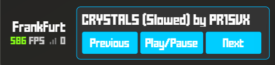
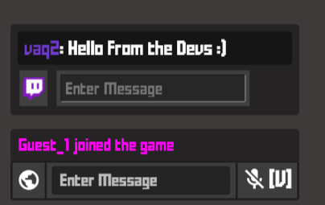
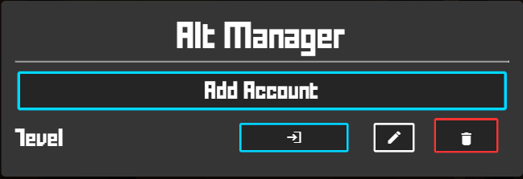
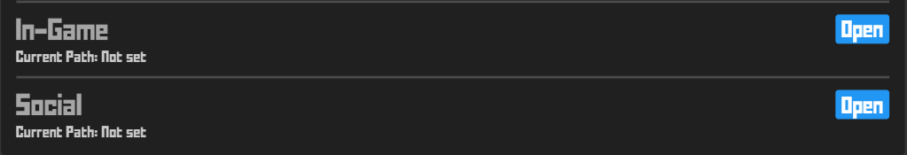
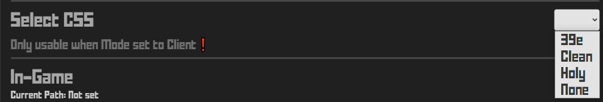
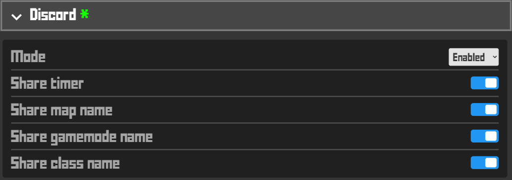

<a id="readme-top"></a>


<br />
<div align="center">
  <a href="https://github.com/vaqqq/nxt-client-lite">
    
  </a>

  <h3 align="center">NXT Lite</h3>

  <p align="center">
    The future of Krunker clients. 
    <br />
    <a href="#getting-started"><strong>Getting Started »</strong></a>
    <br />
    <br />
    <a href="https://discord.gg/mE6KyEeVMK">Report Bug</a>
    ·
    <a href="https://discord.gg/mE6KyEeVMK">Request Feature</a>
  </p>
</div>

---

<!-- TABLE OF CONTENTS -->
<details>
  <summary>Table of Contents</summary>
  <ol>
    <li>
      <a href="#about-the-project">About the Project</a>
    </li>
    <li>
      <a href="#getting-started">Getting Started</a>
      <ul>
        <li><a href="#installation">Installation</a></li>
      </ul>
    </li>
    <li>
      <a href="#beta-features">Features</a> <!-- Fixed capitalization and spacing -->
      <ul>
        <li><a href="#important">Important</a></li>
        <li><a href="#nxt-css">NXT CSS</a></li>
        <li><a href="#discord-rpc">Discord RPC</a></li>
        <li><a href="#single-key-login">Single Key Login</a></li>
        <li><a href="#unlimited-fps">Unlimited FPS</a></li>
        <li><a href="#helpful-flags">Helpful Flags</a></li>
        <li><a href="#shortcuts">Shortcuts</a></li>
      </ul>
    </li>
    <li><a href="#❤️-contributors">❤️ Contributors</a></li> <!-- Changed to text-only anchor -->
    <li><a href="#👥-development-team">👥 Development Team</a></li>
    <li><a href="#license">License</a></li>
    <li><a href="#contact">Contact</a></li>
  </ol>
</details>

---

<!-- ABOUT HOLY -->
## About the Project

<a href="https://github.com/vaqqq/nxt-client-lite">
  
</a>

Welcome to the Lite version of [NXT](https://github.com/vaqqq/nxt-client)!

A new Krunker client specialized for **competitive gameplay** and **low-end PCs**. Performance-robbing functions are not present in this version of NXT, so that you can enjoy your games with maximum performance. Nevertheless, it has some features to offer.

<p align="right">(<a href="#readme-top">back to top</a>)</p>

---

<!-- GETTING STARTED -->
## Getting Started

### Installation

1. Get the latest version of the client at [[Click Here]](https://github.com/vaqqq/nxt-client-lite/releases)
2. Download the .exe file. It looks like:
   ```sh
   NXT-Lite-Setup-{version}.exe
   ```
3. If Windows Defender flags the file as potentially harmful, click on `"More info"` and then `"Run anyway"` to proceed.

<p align="right">(<a href="#readme-top">back to top</a>)</p>

---

<!-- FEATURES -->
## Beta Features

### Important
- 

Connect the client to your Spotify account. Skip, pause/resume, and go back to previous songs seamlessly within the app.

<a href="https://github.com/vaqqq/nxt-client-lite">
  
</a>

---

- 

Connect to Twitch with a clean chat interface, allowing communication with viewers without performance loss.

<a href="https://github.com/vaqqq/nxt-client-lite">
  
</a>

---

- 

Easily manage and switch between your accounts using our Alt Manager.

<a href="https://github.com/vaqqq/nxt-client-lite">
  
</a>

`Note: All your account information is stored locally on your machine and is always accessible. The passwords are also all encrypted with a strong encryption algorithm.`

---

<!-- NXT CSS -->

## NXT CSS

### Custom 

Uses a custom CSS that you can set using these options.

<a href="https://github.com/vaqqq/nxt-client-lite">
  
</a>

To choose a file, simply navigate to the file that you would want to use as your CSS using the popup and select said file.


### Swapper

Path: `%appData%/Roaming/holy/HolySwapper`

Insert your CSS files here to apply them in-game. Name the game CSS as `main_custom` and the hub CSS as `social_custom`.

#### Client

Allows you to choose one of the CSS's that are built into the Holy.

<a href="https://github.com/vaqqq/nxt-client-lite">
  
</a>

#### Disabled

Disables any Client CSS that is being used.

---

### Discord RPC

Settings for your Discord Rich Presence.

<a href="https://github.com/vaqqq/nxt-client-lite">
  
</a>

---

### Single Key Login

Log in with one of your alt accounts at any time with a single button:

- `F6 - First account`
- `F7 - Second account`
- `F8 - Third account`

---

### Unlimited FPS

Maximize performance with optimized frame rates.

---

### Helpful Flags

We've tested some Chromium flags that might be helpful for gameplay. ╮ (. ❛ ᴗ ❛.) ╭


<p align="right">(<a href="#readme-top">back to top</a>)</p>

---

### Shortcuts

| Shortcut | Function |
|----------|----------|
| CTRL + Shift + F1 | Temporarily remove CSS |
| F4 | Find random game |
| F5 | Reload |
| F6 | Login with 1st Alt Account |
| F7 | Login with 2nd Alt Account |
| F8 | Login with 3rd Alt Account |

---

<!-- ❤️ CONTRIBUTORS SECTION -->
## ❤️ Contributors

Our beloved contributors:

> [@babybloo]() | High-quality designing

> [@dunedude]() | Funny features, Developer

> [@Error]() | Code Rewrite

<p align="right">(<a href="#readme-top">back to top</a>)</p>

---

<!-- 👥 DEVELOPMENT TEAM SECTION -->
## 👥 Development Team

> [@Cryz我]() | Developer

> [@Vaq]() | Developer, Designer

> [@Myffo]() | Developer

<p align="right">(<a href="#readme-top">back to top</a>)</p>

---

<!-- LICENSE SECTION -->
## License

Distributed under a proprietary license. See `LICENSE.md` for more information.

<p align="right">(<a href="#readme-top">back to top</a>)</p>

---

<!-- CONTACT SECTION -->
## Contact

- Discord Support Server - [[Click Here]](https://discord.gg/mE6KyEeVMK)
- Email - contact@holy-client.com
- Website - [holy-client.com](https://nxt-client.com/)

<p align="right">(<a href="#readme-top">back to top</a>)</p>

---
